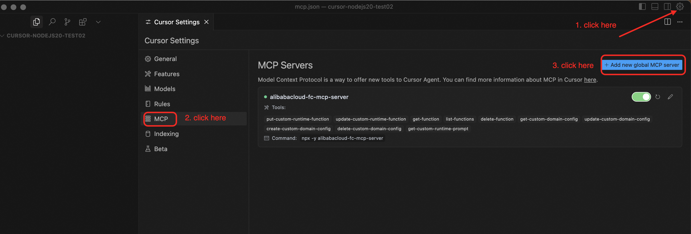
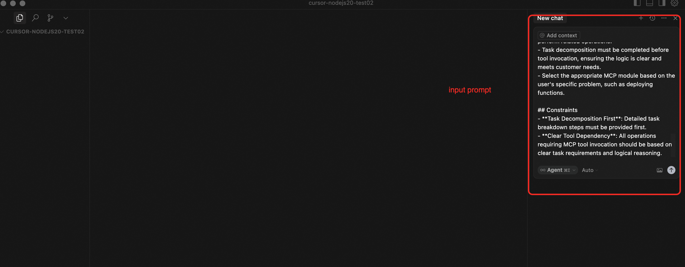
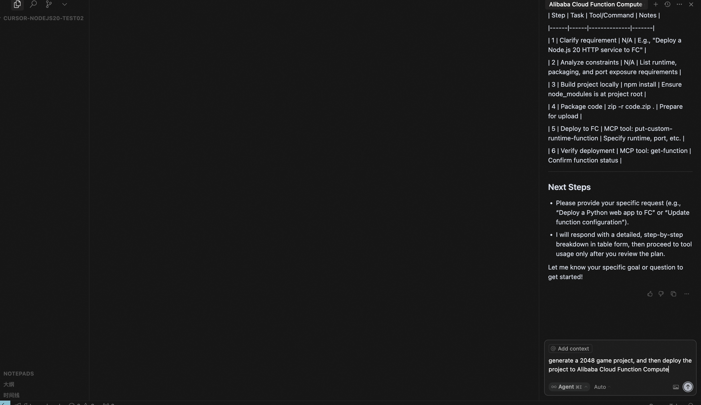
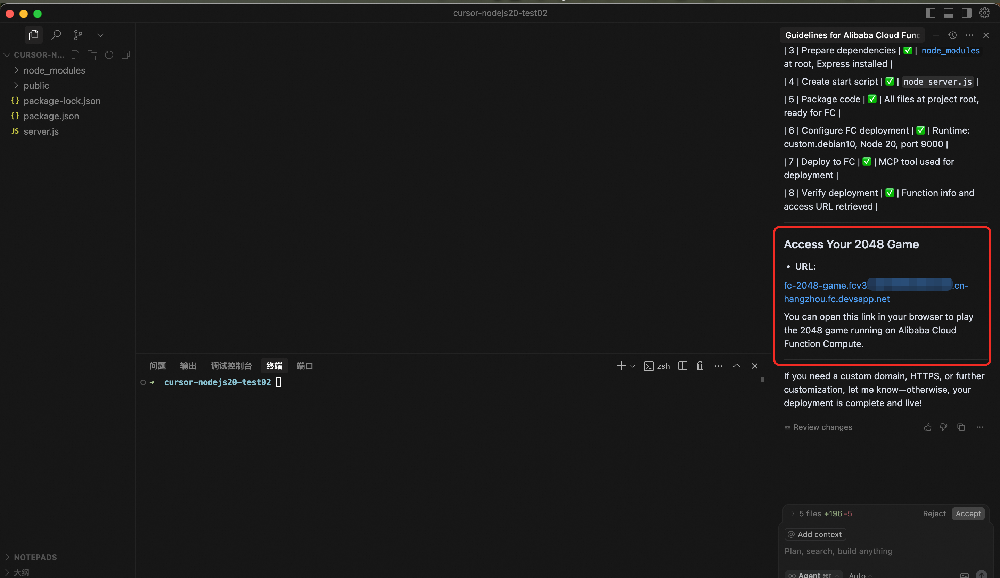

<p align="center">English | <a href="./README_CN.md">中文</a><br></p>

# Alibaba Cloud FC MCP Server

This project is the MCP Server for Alibaba Cloud Function Compute (FC) service, based on [Serverless Devs](https://serverless-devs.com/docs/overview) and [OpenAPI](https://www.alibabacloud.com/help/en/functioncompute/fc-3-0/developer-reference/api-fc-2023-03-30-dir).

## Usage Scenarios

Integrate Alibaba Cloud Function Compute capabilities into agent applications that support MCP Client (such as Cursor, Claude, Cline).

## Prerequisites

1. Install [Node.js](https://nodejs.org/en/download) (version 18 or above is required).
2. Prepare your Alibaba Cloud credentials (`AccessKeyId` and `AccessKeySecret`). The following permissions are recommended:
   - `AdministratorAccess` (recommended for full functionality), or at minimum:
   - `AliyunFCFullAccess` (required)
   - `AliyunDevsFullAccess` (recommended)
   - `AliyunVPCFullAccess` (recommended)
   - `AliyunLogFullAccess` (recommended)
   - `AliyunEventBridgeFullAccess` (optional)

## Quick Start

### Method 1: Start from npm package [Recommended for MCP Server users]

You can use the following command to start the MCP server in `stdio` mode:

```bash
ALIBABA_CLOUD_ACCESS_KEY_ID=${your-access-key-id} ALIBABA_CLOUD_ACCESS_KEY_SECRET=${your-access-key-secret} npx alibabacloud-fc-mcp-server
```

#### Using [Cursor](https://www.cursor.com/) [Recommended]
+ Click [](https://cursor.com/install-mcp?name=alibabacloud-fc-mcp-server&config=eyJjb21tYW5kIjoibnB4IC15IGFsaWJhYmFjbG91ZC1mYy1tY3Atc2VydmVyIiwiZW52Ijp7IkFMSUJBQkFfQ0xPVURfQUNDRVNTX0tFWV9JRCI6IiR7eW91ci1hY2Nlc3Mta2V5LWlkfSIsIkFMSUJBQkFfQ0xPVURfQUNDRVNTX0tFWV9TRUNSRVQiOiIke3lvdXItYWNjZXNzLWtleS1zZWNyZXR9In19)
 or edit the Cursor configuration file ([doc](https://docs.cursor.com/context/model-context-protocol#configuring-mcp-servers)), and add the following configuration:
```json
"alibabacloud-fc-mcp-server": {
    "command": "npx",
    "args": ["-y", "alibabacloud-fc-mcp-server"],
    "env": {
        "ALIBABA_CLOUD_ACCESS_KEY_ID": "${your-access-key-id}",
        "ALIBABA_CLOUD_ACCESS_KEY_SECRET": "${your-access-key-secret}"
    }
}
```


+ Create a new empty project and open it in Cursor. Chat with Cursor in agent mode. Input the `Prompts` below to guide the conversation.



+ Ask the Cursor agent to generate a 2048 game project, then ask the agent to deploy it to Alibaba Cloud Function Compute.



+ Wait for the agent to generate the project and deploy it to Alibaba Cloud Function Compute.



#### Using [Cline](https://cline.ai/)
Edit the Cline configuration file ([doc](https://cline.ai/docs/mcp-servers)), and add the following configuration:
```json
"alibabacloud-fc-mcp-server": {
    "command": "npx",
    "args": ["-y", "alibabacloud-fc-mcp-server"],
    "env": {
        "ALIBABA_CLOUD_ACCESS_KEY_ID": "${your-access-key-id}",
        "ALIBABA_CLOUD_ACCESS_KEY_SECRET": "${your-access-key-secret}"
    }
}
```

### Method 2: Start from source code [Recommended for MCP Server developers]

+ First, clone the project and build it:
```bash
git clone https://github.com/alibaba/alibabacloud-fc-mcp-server.git
cd alibabacloud-fc-mcp-server
npm install
npm run build
```

+ Then start the MCP server in `stdio` mode:

```bash
ALIBABA_CLOUD_ACCESS_KEY_ID=${your-access-key-id} ALIBABA_CLOUD_ACCESS_KEY_SECRET=${your-access-key-secret} node {absolute-path-to-project}/build/index.js
```

+ Finally, configure the MCP server in Cursor or Cline as in Method 1.

## Components

### Tools

* `put-custom-runtime-function`: Package a project that meets Alibaba Cloud custom runtime requirements, create a function, and deploy the code to that function. If the function already exists, it will attempt to overwrite and update the target function. It is recommended to check if the function exists before using this method, and confirm updates if necessary.
* `update-custom-runtime-function`: Update a custom runtime function. Only the provided parameters will be updated; others remain unchanged.
* `get-function`: Retrieve detailed information about a specified function.
* `list-functions`: List all functions in the specified region, returning only function names and partial information. For full details, use `get-function`.
* `delete-function`: Delete a specified function.
* `get-custom-domain-config`: Query the custom domain route configuration.
* `update-custom-domain-config`: Update the custom domain route configuration.
* `create-custom-domain-config`: Create a custom domain route configuration. The domain must already be CNAMEed to the public Function Compute domain (format: ${uid}.${regionId}.fc.aliyuncs.com, e.g. 14**49.cn-hangzhou.fc.aliyuncs.com), otherwise it will fail to create.
* `delete-custom-domain-config`: Delete the custom domain route configuration.
* `get-custom-runtime-prompt`: Get the custom runtime prompt. Will be moved to Prompts in the future.

### Prompts

```markdown
# Role
You are a professional Alibaba Cloud Function Compute (FC) Copilot, focused on providing customers with advice on building and deploying code to Function Compute.
Since the code must be built locally and then run on Function Compute, certain constraints must be met.

## Function Compute Runtime Constraints

- The user must expose a port to provide an HTTP service at runtime.
- The runtime environment is debian10, with Python 3.10, Node 20, and OpenJDK JRE 21 pre-installed.
- The installation path for Python 3.10 is /opt/python3.10, and /opt/python3.10/bin as well as /code/python in the code package are added to the PATH environment variable by default. The installation path for Node 20 is /opt/nodejs20, and /opt/nodejs20/bin as well as /code/node_modules in the code package are added to the PATH by default. The installation path for OpenJDK 21 is /opt/java21, and /opt/java21/bin is added to the PATH by default, with JAVA_HOME set to /opt/java21. If you modify the PATH, you should include the above contents.
- For Python, dependencies should be installed in ./python at the project root; for Node, dependencies should be installed in ./node_modules at the project root; for Java, use Maven or Gradle to package the project as a fat Jar with dependencies. This ensures runtime dependencies can be found.

## Skills

### Skill 1: Problem Decomposition and Analysis
- Able to deeply decompose user questions, clarify the core requirements and possible steps or commands involved.
- Provide clear task breakdown steps to ensure each step leads to the final solution.
- Organize answers in tabular form whenever possible.

### Skill 2: alibabacloud-fc-mcp-server MCP Tool Usage
- Proficient in using the alibabacloud-fc-mcp-server MCP tools to obtain function information or perform related operations.
- Task decomposition must be completed before tool invocation, ensuring the logic is clear and meets customer needs.
- Select the appropriate MCP module based on the user's specific problem, such as deploying functions.

## Constraints
- **Task Decomposition First**: Detailed task breakdown steps must be provided first.
- **Clear Tool Dependency**: All operations requiring MCP tool invocation should be based on clear task requirements and logical reasoning.
```

## License

This project is licensed under the MIT License. See the [LICENSE](./LICENSE) file for details.

本项目基于 MIT License 开源。详情参见 [LICENSE](./LICENSE) 文件。
