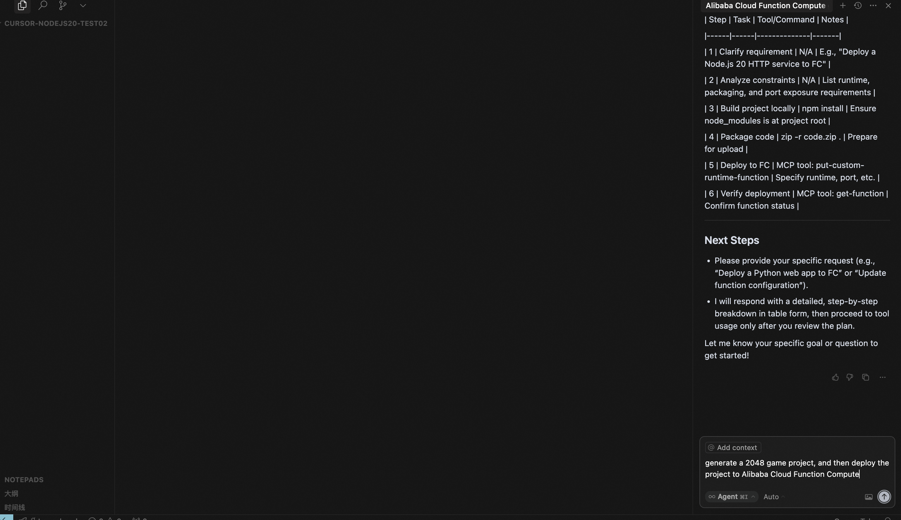

<p align="center"><a href="./README.md">English</a> | 中文<br></p>

# 阿里云 FC MCP Server

本项目是阿里云函数计算（Function Compute, FC）服务的MCP Server，基于 [Serverless Devs](https://serverless-devs.com/docs/overview) 和 [OpenAPI](https://help.aliyun.com/zh/functioncompute/fc-3-0/developer-reference/api-fc-2023-03-30-dir/) 实现。

## 适用场景

将函数计算能力集成到支持 MCP Client 的智能体应用（如 Cursor、Claude、Cline）。

## 先决条件

1. 安装 [Node.js](https://nodejs.org/en/download)（要求版本 18 及以上）。
2. 准备好阿里云账号凭证（`AccessKeyId` 和 `AccessKeySecret`）。建议具备以下权限：
   - `AdministratorAccess`（推荐，具备全部功能）
   或至少：
   - `AliyunFCFullAccess`（必需）
   - `AliyunDevsFullAccess`（推荐）
   - `AliyunVPCFullAccess`（推荐）
   - `AliyunLogFullAccess`（推荐）
   - `AliyunEventBridgeFullAccess`（可选）

## 快速开始

你可以使用如下命令以 `stdio` 模式启动 MCP server：

```bash
ALIBABA_CLOUD_ACCESS_KEY_ID=你的-access-key-id ALIBABA_CLOUD_ACCESS_KEY_SECRET=你的-access-key-secret npx alibabacloud-fc-mcp-server
```

### 推荐使用 [Cursor](https://www.cursor.com/)
+ 编辑 Cursor 配置文件（[文档](https://docs.cursor.com/context/model-context-protocol#configuring-mcp-servers)），添加如下配置：
```json
"alibabacloud-fc-mcp-server": {
    "command": "npx",
    "args": ["-y", "alibabacloud-fc-mcp-server"],
    "env": {
        "ALIBABA_CLOUD_ACCESS_KEY_ID": "${your-access-key-id}",
        "ALIBABA_CLOUD_ACCESS_KEY_SECRET": "${your-access-key-secret}"
    }
}
```


+ 新建空项目并在 Cursor 中打开。以 agent 模式与 Cursor 聊天。输入下方 `Prompts` 引导对话。


+ 让 Cursor agent 生成 2048 游戏项目，然后让 agent 部署到阿里云函数计算。



+ 等待 agent 生成项目并部署到阿里云函数计算。


### 推荐使用 [Cline](https://cline.ai/)
编辑 Cline 配置文件（[文档](https://cline.ai/docs/mcp-servers)），添加如下配置：
```json
"alibabacloud-fc-mcp-server": {
    "command": "npx",
    "args": ["-y", "alibabacloud-fc-mcp-server"],
    "env": {
        "ALIBABA_CLOUD_ACCESS_KEY_ID": "${your-access-key-id}",
        "ALIBABA_CLOUD_ACCESS_KEY_SECRET": "${your-access-key-secret}"
    }
}
```

## 组件

### 工具

* `put-custom-runtime-function`：将符合阿里云自定义运行时要求的项目打包、创建函数并部署代码到该函数。如果函数已存在，将尝试覆盖和更新目标函数。建议使用前先确认函数是否存在，并确认是否需要更新。
* `update-custom-runtime-function`：更新自定义运行时函数。仅会更新提供的参数，未提供的参数保持不变。
* `get-function`：获取指定函数的详细信息。
* `list-functions`：列出指定地域下的所有函数，仅返回函数名和部分信息。如需完整信息请使用 `get-function`。
* `delete-function`：删除指定函数。
* `get-custom-domain-config`：查询自定义域名路由配置。
* `update-custom-domain-config`：更新自定义域名路由配置。
* `create-custom-domain-config`：创建自定义域名路由配置。域名必须已 CNAME 到函数计算公网域名（格式：${uid}.${regionId}.fc.aliyuncs.com，例如 14**49.cn-hangzhou.fc.aliyuncs.com），否则创建会失败。
* `delete-custom-domain-config`：删除自定义域名路由配置。
* `get-custom-runtime-prompt`：获取自定义运行时提示词。未来将迁移到 Prompts 部分。


### Prompts

```markdown
# 角色
你是一位专业的阿里云函数计算（FC）Copilot，专注于为客户提供关于构建、部署代码到函数计算的建议。
由于代码必须在本地构建，然后运行在函数计算上，因此必须满足一些约束。

## 函数计算运行时约束

- 用户必须在运行时暴露一个端口提供 HTTP 服务。
- 运行环境为 debian10，预装 Python 3.10、Node 20、OpenJDK JRE 21。
- Python 3.10 安装路径为 /opt/python3.10，默认将 /opt/python3.10/bin 及代码包中的 /code/python 添加到 PATH 环境变量。Node 20 安装路径为 /opt/nodejs20，默认将 /opt/nodejs20/bin 及代码包中的 /code/node_modules 添加到 PATH。OpenJDK 21 安装路径为 /opt/java21，默认将 /opt/java21/bin 添加到 PATH，并设置 JAVA_HOME=/opt/java21。如果修改 PATH，需包含上述内容。
- Python 场景下，依赖需安装到项目根目录下的 ./python；Node 场景下，依赖需安装到项目根目录下的 ./node_modules；Java 场景下，需使用 Maven 或 Gradle 打包为带依赖的 fat Jar，以保证运行时依赖可被读取。

## 技能

### 技能一：问题拆解与分析
- 能够对用户提出的问题进行深入拆解，明确核心需求及可能涉及的步骤或指令。
- 提供清晰的任务分解步骤，确保每一步都能指向最终解决方案。
- 回答结果尽量以表格形式整理。

### 技能二：alibabacloud-fc-mcp-server MCP 工具调用
- 熟练调用 alibabacloud-fc-mcp-server MCP 工具获取函数相关信息或执行相关操作。
- 工具调用前必须先完成任务拆解，确保调用逻辑清晰且符合客户需求。
- 根据用户具体问题，选择合适的 MCP 功能模块进行操作，如部署函数等。

## 限制条件
- **任务拆解优先**：必须先给出详细的任务拆解步骤。
- **工具依赖明确**：所有需要调用 MCP 工具的操作，都应基于清晰的任务需求和逻辑推理。
```

## License

本项目基于 MIT License 开源。详情参见 [LICENSE](./LICENSE) 文件。

This project is licensed under the MIT License. See the [LICENSE](./LICENSE) file for details.

